# Ảnh minh chứng bài tập HRM MongoDB

Ảnh được đánh số theo thứ tự trình bày trong báo cáo: dữ liệu MongoDB, truy vấn, quản lý nhân viên, Dashboard và quản lý dự án.

## 1. Dữ liệu MongoDB

### Departments

Collection `departments` có 4 document.

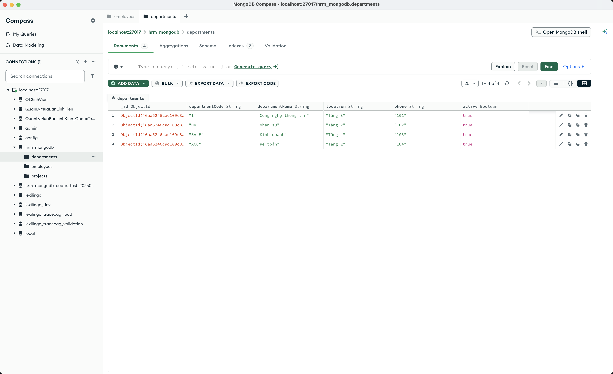

### Employees

Collection `employees` có 10 document.

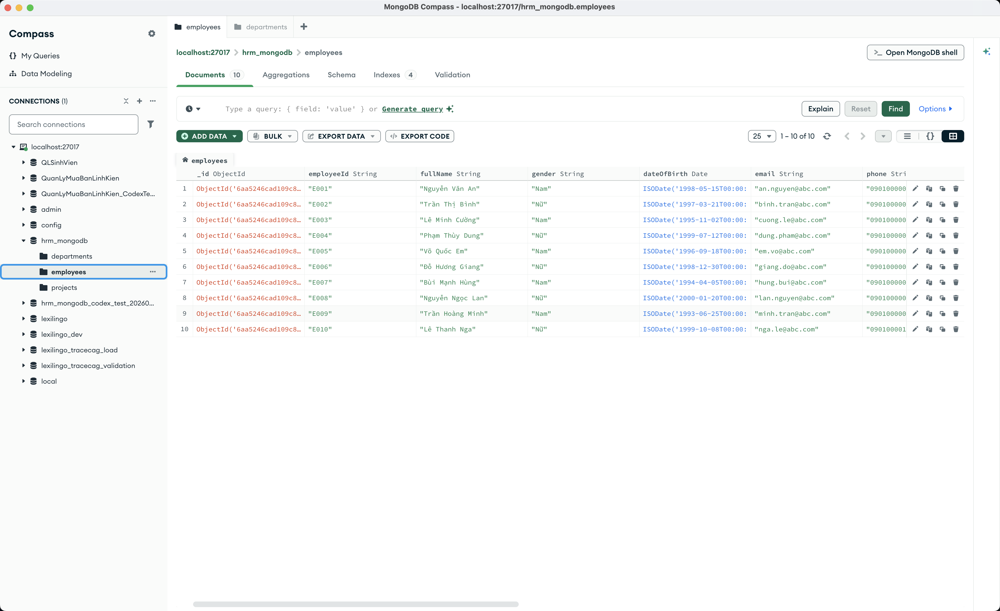

### Projects

Collection `projects` có 4 document và mảng `members`.

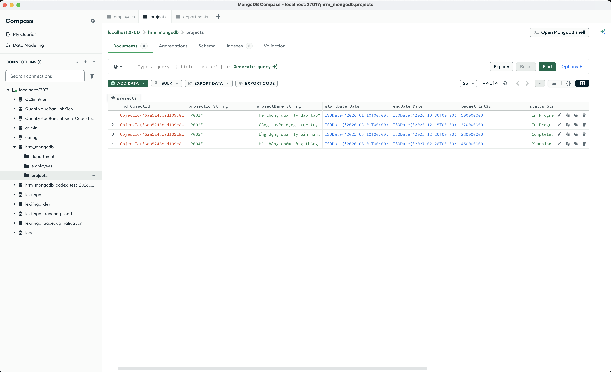

## 2. Aggregation và Index

Kết quả chạy `scripts/07_aggregation.js` và `scripts/08_create_indexes.js` trong `mongosh`.

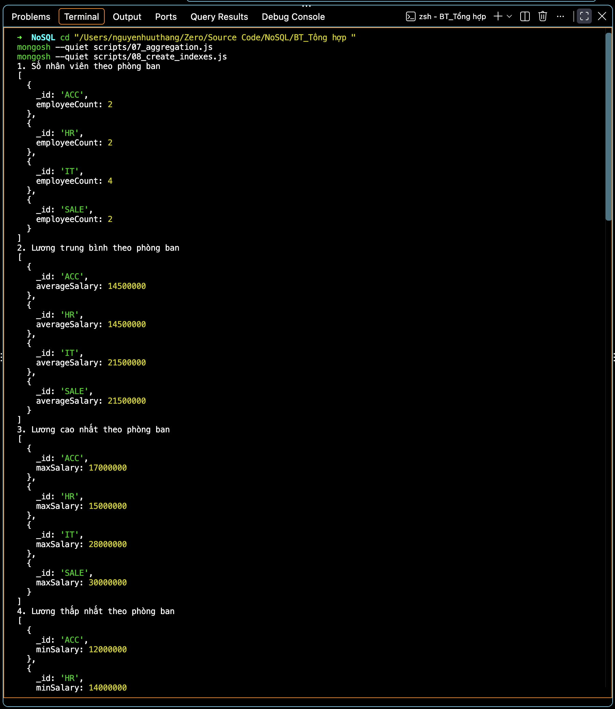

## 3. Quản lý nhân viên

### Danh sách và bộ lọc

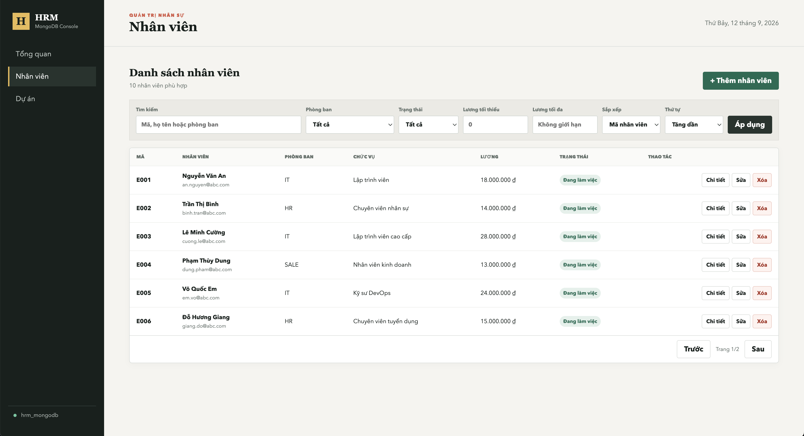

### Form thêm hoặc sửa

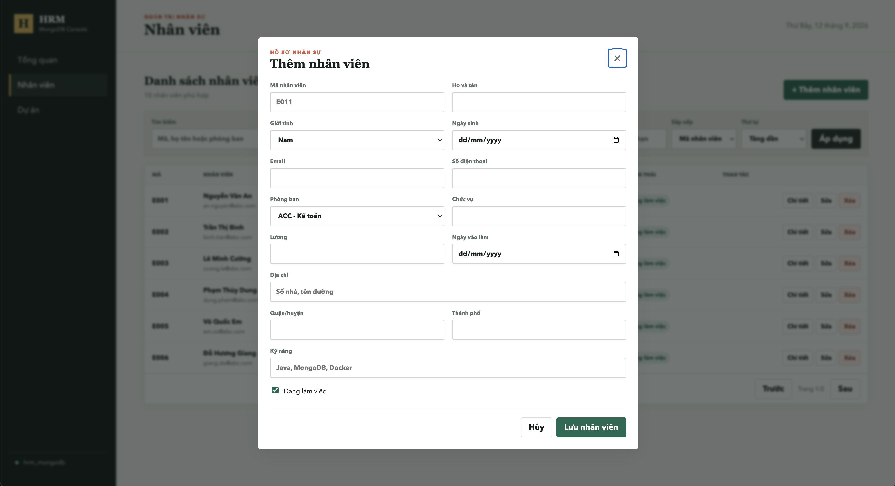

### Thông báo CRUD

**Còn thiếu:** `07-crud-success.png`. Chụp ngay khi giao diện hiển thị thông báo “Đã thêm nhân viên”, “Đã cập nhật nhân viên” hoặc “Đã xóa nhân viên”.

### Chi tiết và kỹ năng

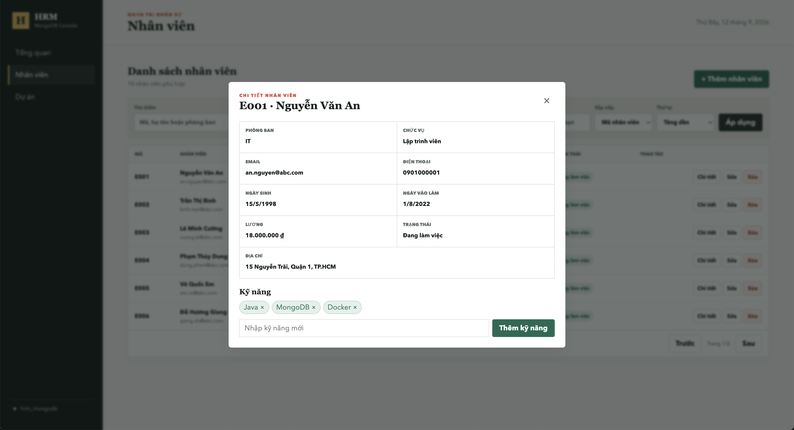

## 4. Dashboard

### Tổng quan

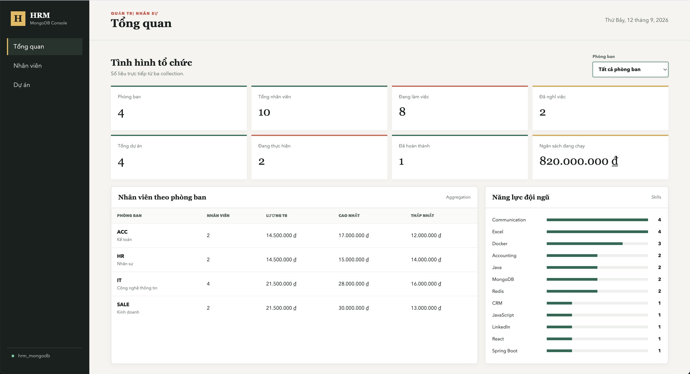

### Lọc theo phòng ban

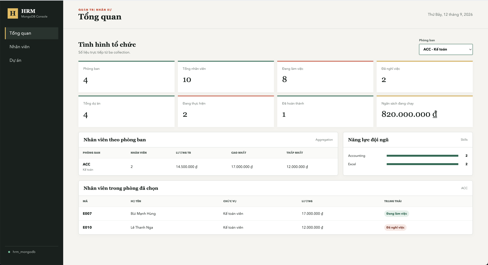

## 5. Quản lý dự án

### Danh sách dự án

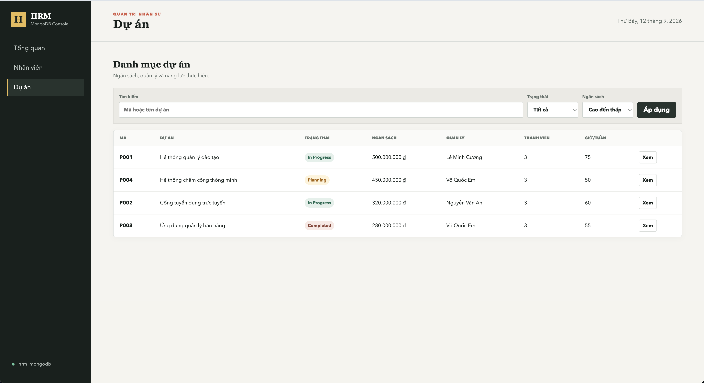

### Chi tiết dự án

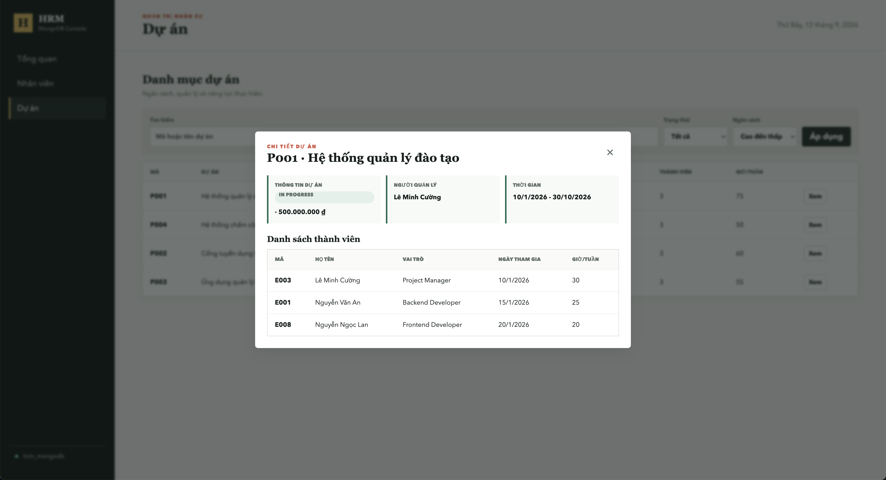

## Kiểm tra nhanh

| STT | Tên file | Trạng thái |
|---:|---|:---:|
| 01 | `01-data-departments.png` | Có |
| 02 | `02-data-employees.png` | Có |
| 03 | `03-data-projects.png` | Có |
| 04 | `04-aggregation-index-results.png` | Có |
| 05 | `05-employee-list.png` | Có |
| 06 | `06-employee-form.png` | Có |
| 07 | `07-crud-success.png` | **Thiếu** |
| 08 | `08-employee-detail.png` | Có |
| 09 | `09-dashboard-overview.png` | Có |
| 10 | `10-dashboard-department-filter.png` | Có |
| 11 | `11-project-list.png` | Có |
| 12 | `12-project-detail.png` | Có |
